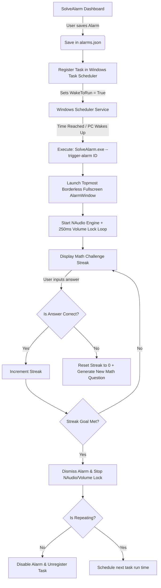

# ⏰ SolveAlarm

[](#)
[](#)
[](#)

SolveAlarm is a strict, native Windows **.NET 8 WPF alarm desktop application** designed specifically for heavy sleepers. Unlike standard alarm apps, SolveAlarm hooks deep into Windows native sub-systems to ensure you **cannot bypass or ignore** your alarm. It wakes your computer from Sleep mode and forces you to solve a streak of mathematical equations to dismiss the alarm.

---

## 🚀 Key Features

| Feature | Description | Implementation Details |
| :--- | :--- | :--- |
| **💤 Wake-from-Sleep** | Automatically schedules task triggers in Windows Task Scheduler using `WakeToRun` property to turn on/wake up the PC from Sleep. | Integrated via COM wrapper `Microsoft.Win32.TaskScheduler`. |
| **🔒 Anti-Bypass Lock** | Launches a borderless, fullscreen, topmost alarm window that locks system focus. Alt+F4, window minimization, and focus loss are blocked. | Custom Window state-tracking loop. Re-activates/re-focuses window and textbox input immediately. |
| **🔊 Volume Enforcement** | Forces master system volume to 100% and unmutes every 250ms during an active alarm. | Uses CoreAudio endpoints via `NAudio.CoreAudioApi`. |
| **🧮 Math Challenges** | Generates dynamic math equations (Easy, Medium, Hard difficulty) requiring a streak of correct answers (up to 3-5 in a row). An incorrect answer resets the streak. | Custom mathematical generation engine in `MathChallenge.cs`. |
| **🎵 Audio Fail-Safe** | Plays custom `.mp3` or `.wav` sounds, falling back to a custom-synthesized oscillating frequency sweep siren if files are missing or corrupted. | Custom synthesized `AlarmSampleProvider` inside NAudio player. |
| **📅 Recurrence & State** | Supports one-time and recurring alarms (selected weekdays). Single-instance Mutex ensures only one dashboard runs. | Local JSON storage under `%APPDATA%\SolveAlarm\alarms.json`. |

---

## 🛠️ Architecture & How It Works

The following flowchart describes the lifecycle of an alarm, from setting it up in the dashboard to triggering and solving the challenge.



---

## 📋 Installation & Setup

1. **Copy Build Files:**
   Copy the contents of the `release_build/` folder to a permanent folder on your PC (e.g. `C:\Program Files\SolveAlarm\` or `C:\Users\<Name>\AppData\Local\SolveAlarm\`).

2. **Run as Administrator:**
   Because SolveAlarm interacts with the Windows Task Scheduler to register system tasks, it **must run with administrative privileges**. 
   * Right-click `SolveAlarm.exe` and select **Run as Administrator**.
   * *Tip:* Right-click `SolveAlarm.exe` -> **Properties** -> **Compatibility** tab -> Check **Run this program as an administrator** to make this permanent.

3. **Desktop Shortcut:**
   Create a shortcut to the application on your Desktop or Pin it to the Taskbar for quick management.

---

## ⚡ Windows Power Configurations (Crucial)

To guarantee the wake-from-sleep feature wakes up your system, ensure the following Windows configurations are applied:

### 1. Enable Wake Timers
1. Click the **Open Power Options** button in the SolveAlarm dashboard (or run `control powercfg.cpl` in Windows).
2. Click **Change plan settings** next to your active power plan.
3. Click **Change advanced power settings**.
4. Scroll to **Sleep** and expand it.
5. Expand **Allow wake timers** and set both **On battery** and **Plugged in** to **Enable**.

> [!IMPORTANT]
> If "Allow wake timers" is disabled, Windows will block the Task Scheduler from waking your computer, and the alarm will not sound until you manually power on the machine.

### 2. Supported Sleep States
* SolveAlarm wakes the computer from the **Sleep (S3)** state.
* **Modern Standby (S0):** Some modern laptops use Modern Standby. SolveAlarm still triggers, but verify hardware compatibility by scheduling a test alarm 2 minutes in the future.
* **Hibernate / Shut Down:** Wake timers cannot wake up a completely shut down machine or some hibernating laptops (S4) depending on motherboards. Keep the system in **Sleep** mode.

---

## 🧮 Math Challenge Difficulty Tiers

When configuring an alarm, you can choose from three difficulty tiers. Solving a question incorrectly resets your streak instantly!

### 🟢 Easy
* **Operations:** Addition (+) and Subtraction (-)
* **Number Range:** `1` to `20`
* **Streak Required:** `2` correct answers
* *Example:* `12 + 7` or `18 - 9`

### 🟡 Medium
* **Operations:** Addition (+), Subtraction (-), and Single multiplication (*)
* **Number Range:** `2` to `12` (Multiplication uses factors `2` to `9`)
* **Streak Required:** `3` correct answers
* *Example:* `8 * 7` or `12 + 11`

### 🔴 Hard
* **Operations:** Advanced two-step arithmetic (parentheses enabled)
* **Format Examples:**
  * `(A + B) * C`
  * `(A - B) * C`
  * `A * B + C`
  * `A * B - C`
* **Number Range:** `2` to `15` (Multipliers `2` to `10`)
* **Streak Required:** `3` correct answers
* *Example:* `(7 + 5) * 8` or `12 * 9 - 14`

---

## 💻 Command Line Arguments

For advanced users or custom scripting, `SolveAlarm.exe` supports several command-line flags:

* `--trigger-alarm <alarm-guid>`: Automatically launches the fullscreen, locked alarm window for the specified alarm configuration.
* `--test-alarm`: Opens a safe, non-locked test window. In test mode:
  * A banner indicates test mode.
  * Pressing `ESC` or clicking the **Exit Test** button safely closes the window without needing to solve the math streak.
  * You can test sound levels and visual responsiveness.

---

## 📂 Developer Section

### Project Directory Structure
```text
SolveAlarm/
├── app_build/
│   ├── Models/
│   │   ├── Alarm.cs              # Alarm configuration object & DayOfWeek flags
│   │   └── AlarmDisplayModel.cs  # Wrapper for WPF binding representation
│   ├── Services/
│   │   ├── AlarmStorage.cs       # Load/Save config from %APPDATA%
│   │   ├── AudioService.cs       # NAudio wrappers & sound generator
│   │   ├── MathChallenge.cs      # Arithmetic generation engines
│   │   └── SchedulerService.cs   # Interfacing with Windows Task Scheduler
│   ├── Views/
│   │   ├── AlarmEditDialog.xaml  # Add/Edit UI modal
│   │   ├── AlarmWindow.xaml      # Locked Fullscreen screen (Alarm triggered)
│   │   └── MainWindow.xaml       # Application dashboard
│   ├── App.xaml                  # WPF Application setup & startup arguments
│   └── SolveAlarm.csproj         # MSBuild project file
└── release_build/                # Ready-to-run compiled binary packages
```

### Core Code Snippets

#### 1. Audio Level Enforcement Loop (`AudioService.cs`)
NAudio is used to query the default endpoint device, unmute it, and set the scalar volume to `1.0f` (100%) on a `250ms` repeating callback.
```csharp
private void ForceMaxVolumeAndUnmute()
{
    using (var enumerator = new MMDeviceEnumerator())
    {
        using (var device = enumerator.GetDefaultAudioEndpoint(DataFlow.Render, Role.Multimedia))
        {
            if (device != null)
            {
                if (device.AudioEndpointVolume.Mute)
                    device.AudioEndpointVolume.Mute = false;

                if (device.AudioEndpointVolume.MasterVolumeLevelScalar < 1.0f)
                    device.AudioEndpointVolume.MasterVolumeLevelScalar = 1.0f;
            }
        }
    }
}
```

#### 2. Strict Focus & Alt+F4 Protection (`AlarmWindow.xaml.cs`)
Alt+F4 is bypassed by cancelling window closing if the challenge isn't completed, and focus loss automatically triggers a re-focus timer:
```csharp
private void Window_Closing(object sender, CancelEventArgs e)
{
    if (!_challengeSolved && !_isTestMode)
    {
        e.Cancel = true; // Block alt-f4
    }
}

private void Window_Deactivated(object sender, EventArgs e)
{
    if (!_challengeSolved && !_isTestMode)
    {
        // Re-focus and force back to front
        Dispatcher.BeginInvoke(new Action(() =>
        {
            this.Topmost = false;
            this.Topmost = true;
            this.Activate();
            this.Focus();
            AnswerTextBox.Focus();
        }));
    }
}
```

---

## 📜 License

SolveAlarm is open-source software licensed under the [MIT License](LICENSE).
