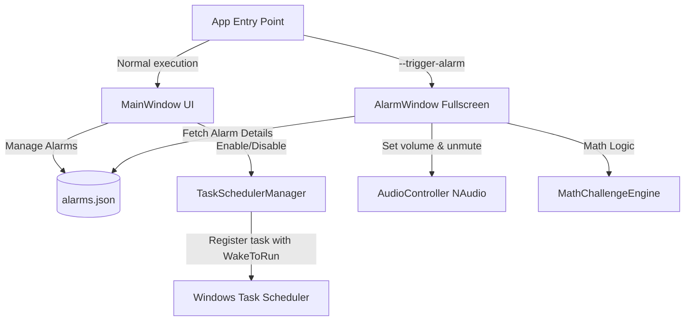

# Technical Specification: SolveAlarm (Revised)

SolveAlarm is a strict, native Windows desktop alarm application built with **C# .NET 8** and **WPF**. It enables users to create alarms that wake the computer from sleep and play a custom sound at full volume. The alarm can only be dismissed by successfully solving a math challenge.

---

## 1. Executive Summary

SolveAlarm provides a reliable solution for heavy sleepers. By combining Windows Task Scheduler (to wake the system and trigger the alarm) and native Windows Core Audio APIs (to lock volume at 100%), the application ensures the alarm is heard. The application enforces a fullscreen, topmost dismiss screen that cannot be easily closed without completing a customizable math challenge (Easy, Medium, Hard) with a streak of 3 consecutive correct answers.

---

## 2. Requirements

### 2.1 Functional Requirements
1. **Alarm CRUD Management**:
   - Create, read, update, delete, enable, and disable alarms.
   - Properties: ID (GUID), Time (Hour/Minute), Repeat Days (flags for Monday-Sunday), Label, IsEnabled, Challenge Difficulty (Easy, Medium, Hard), Sound File Path (custom or default).
2. **Wake-from-Sleep Registration & Scheduling Logic**:
   - When an alarm is enabled, register/update a task in Windows Task Scheduler.
   - Configure the task to run the app with `--trigger-alarm <alarmId>`.
   - Set the task to wake the computer from sleep (`WakeToRun = true`).
   - When an alarm is disabled or deleted, remove the scheduled task.
   - **Scheduling Logic**:
     - **One-time Alarms**: Calculate the next occurrence. If the alarm time has already passed today, schedule it for the same time tomorrow.
     - **Repeating Alarms**: Calculate the next occurrence based on the selected weekdays.
     - **Post-Dismiss Behavior**: After dismissing an alarm, if it is a repeating alarm, recalculate and reschedule its next occurrence. If it is one-time, mark it as disabled.
3. **Alarm Trigger Mode**:
   - Start the application in a fullscreen trigger mode using command-line arguments.
   - Display a borderless, fullscreen, topmost window.
   - Intercept closing events (`Alt + F4` or standard window close).
   - Periodically check focus; if the window loses focus or is minimized, restore it and bring it to front.
   - Play the selected sound in a loop.
4. **Test Alarm Mode**:
   - Launching a "Test Alarm" opens the fullscreen alarm screen safely.
   - It plays the sound and shows the math challenge.
   - It **must** include a visible "Exit Test" button (or allow Esc-key confirmation) so the user can easily dismiss it.
   - Real triggered alarms (launched with `--trigger-alarm <alarmId>`) **must not** show this exit escape.
5. **Single Instance Behavior**:
   - Use a system-wide `Mutex` to prevent running duplicate instances of the normal UI. If a normal instance is launched while one is already running, activate and bring the existing UI window to the front, then exit.
   - If launched with `--trigger-alarm <alarmId>` or in test mode, bypass the mutex check to allow the alarm window to run even if the main UI is active.
6. **Core Audio Control**:
   - Set system volume to 100% and unmute on alarm start.
   - Run a background timer (every 250ms) to ensure volume remains at 100% and unmuted.
7. **Sound Validation**:
   - Support `.mp3` and `.wav` formats.
   - Validate the custom sound file path. If the file is missing, invalid, or unsupported, fall back to the bundled default alarm sound.
   - Show a clear warning indicator in the normal UI if an alarm's custom sound path is invalid.
8. **Math Challenge Engine**:
   - Generate math questions based on chosen difficulty:
     - **Easy**: e.g., `A + B` or `A - B` (numbers 10-99).
     - **Medium**: e.g., `(A + B) * C` or `A * B - C` (numbers 2-20).
     - **Hard**: e.g., `(A - B) * (C + D)` or `A * B + C - D`.
   - Enforce 3 consecutive correct answers. A single incorrect answer resets the streak to 0.
9. **Normal GUI**:
   - Modern, glassmorphism-styled dashboard showing all alarms.
   - Toggle buttons to enable/disable alarms.
   - Settings page for default sounds, global preferences, and troubleshooting.
   - "Test Alarm" button to preview trigger mode safely.

### 2.2 Non-Functional & Safety Requirements
- **No Malware persistence**: The app will not run covertly in the background, hide from Task Manager, or block standard OS controls (like `Ctrl + Alt + Del`, power button, or shutdown commands).
- **Offline Reliability**: Local storage using JSON files. No internet connection required.
- **Windows Integration**: Must run natively on Windows 10/11 x64.
- **No Server**: Must remain a native Windows desktop app, not a web app or a localhost server.

---

## 3. Architecture & Tech Stack



### 3.1 Stack
- **Framework**: .NET 8.0 WPF (Windows Presentation Foundation)
- **Programming Language**: C# 12
- **Audio Library**: `NAudio` (for playback and CoreAudio volume control)
- **Task Scheduler Library**: `Microsoft.Win32.TaskScheduler` (COM wrapper for clean task registration)
- **JSON Storage**: `System.Text.Json`
- **UI Design**: Modern WPF styling (custom controls, acrylic-like transparency/glassmorphism, clean dark mode, Outfit/Inter typography).

### 3.2 Key Projects/Components inside `app_build/`:
- **`SolveAlarm`** (WPF Executable)
  - `Program.cs` / `App.xaml.cs`: Custom entry point checking for arguments,Mutex logic.
  - `Models/Alarm.cs`: Alarm metadata and JSON serialization properties.
  - `Services/AlarmStorage.cs`: Saving/loading alarms from `%APPDATA%\SolveAlarm\alarms.json`.
  - `Services/SchedulerService.cs`: Interacting with Windows Task Scheduler COM APIs to register wake-up tasks.
  - `Services/AudioService.cs`: NAudio wrapper to play alarm sound and force 100% volume/unmute via WASAPI endpoints.
  - `Services/MathChallenge.cs`: Engine generating problems and validating streaks.
  - `Views/MainWindow.xaml`: Main dashboard with custom controls.
  - `Views/AlarmWindow.xaml`: Borderless fullscreen topmost window.
  - `Views/AlarmEditDialog.xaml`: Custom dialog for alarm editing.

---

## 4. Detailed Component Designs

### 4.1 Single Instance Mutex Logic
In `App.xaml.cs`:
```csharp
private static Mutex? _mutex;

protected override void OnStartup(StartupEventArgs e)
{
    bool isTriggerMode = e.Args.Contains("--trigger-alarm") || e.Args.Contains("--test-alarm");
    
    if (!isTriggerMode)
    {
        _mutex = new Mutex(true, "Global\\SolveAlarmMutex", out bool createdNew);
        if (!createdNew)
        {
            // Bring existing window to front (using Win32 API FindWindow and SetForegroundWindow)
            NativeMethods.BringExistingInstanceToFront();
            Current.Shutdown();
            return;
        }
    }
    
    base.OnStartup(e);
}
```

### 4.2 Task Scheduler Registration & Wake Timers
To wake the computer, a task is created:
- **Action**: Run `SolveAlarm.exe` with arguments `--trigger-alarm <guid>`.
- **Trigger**: Matching the calculated next occurrence.
- **Settings**:
  - `WakeToRun = true` (tells Windows to wake the computer from sleep).
  - `RunOnlyIfNetworkAvailable = false`.
  - `DisallowStartIfOnBatteries = false`.
  - `StopIfGoingOnBatteries = false`.
  - `Priority = ThreadPriorityLevel.Highest`.
  - Task name pattern: `SolveAlarm_Alarm_<guid>`.

### 4.3 Windows Wake Troubleshooting (README Checklist)
We will document the following settings in the `README.md`:
1. **Allow Wake Timers**: Go to Edit Power Plan -> Change advanced power settings -> Sleep -> Allow wake timers -> Set to **Enable** (both on battery and plugged in).
2. **Sleep State Requirements**: System must be in Sleep mode (S3) or Modern Standby. It cannot wake from complete Shutdown or Hibernate (S4) unless supported specifically by hardware/drivers.
3. **Lid-Closed Behavior**: Waking with lid closed depends heavily on motherboard/BIOS and OEM settings (some laptops cut audio/video if the lid is closed).
4. **Modern Standby (S0 Low Power Idle)**: Modern standby laptops require wake tasks to be registered properly, which this app handles.

---

## 5. UI/UX Design Goals
- **Dark Mode**: Soft charcoal backgrounds (`#121212`, `#1E1E1E`) and vibrant purple/blue accents (`#8B5CF6`, `#3B82F6`).
- **Glassmorphism**: Use semi-transparent borders with a blur/acrylic look.
- **Typography**: Clear, modern, sans-serif font.
- **Animations**: Fade-in transitions for the challenge state, pulse animations for the correct/incorrect streaks.

---

## 6. Implementation Plan & Deliverables

1. **Step 1**: Initialize WPF .NET 8.0 project structure in `app_build/`.
2. **Step 2**: Implement core models, JSON storage, and math challenge engine.
3. **Step 3**: Implement Audio controller & Task Scheduler wrapper.
4. **Step 4**: Design the Fullscreen Alarm Window (trigger/test views) & Main Dashboard UI.
5. **Step 5**: Integrate all parts, perform audit, and package.

---

**Do you approve this revised Technical Specification?**
